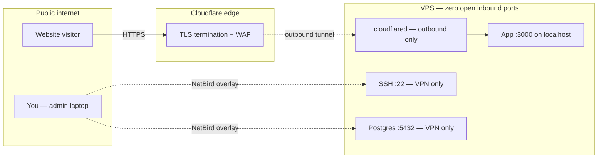
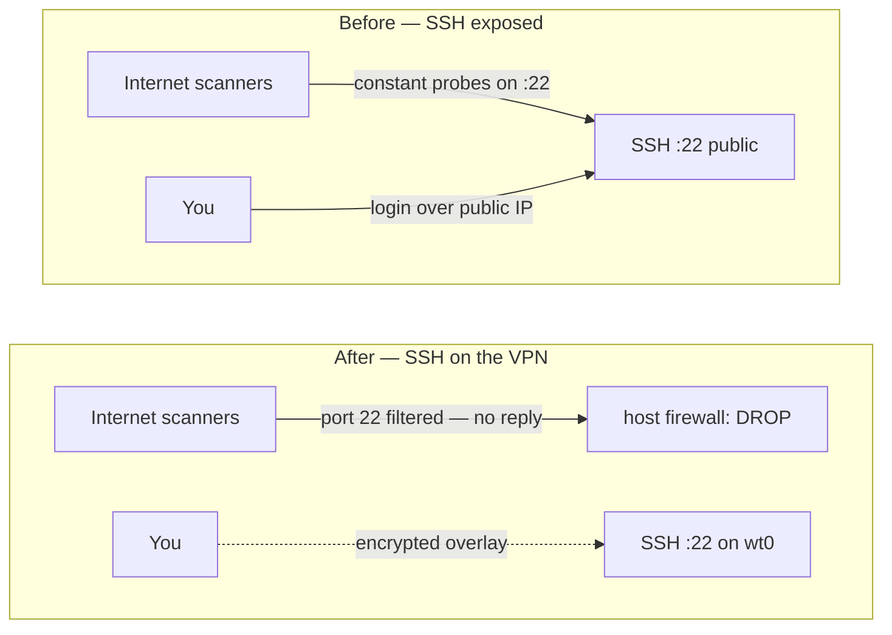
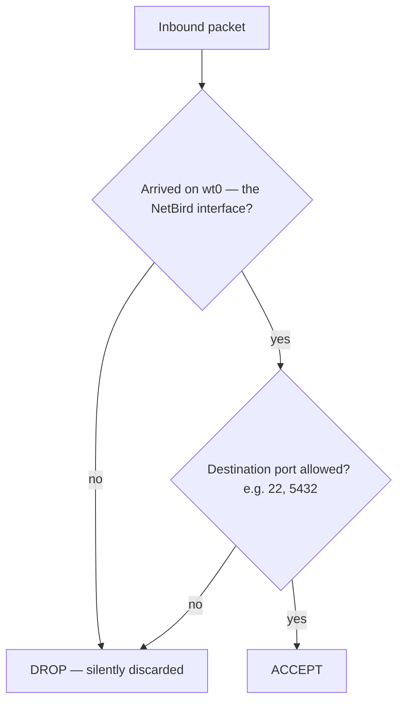
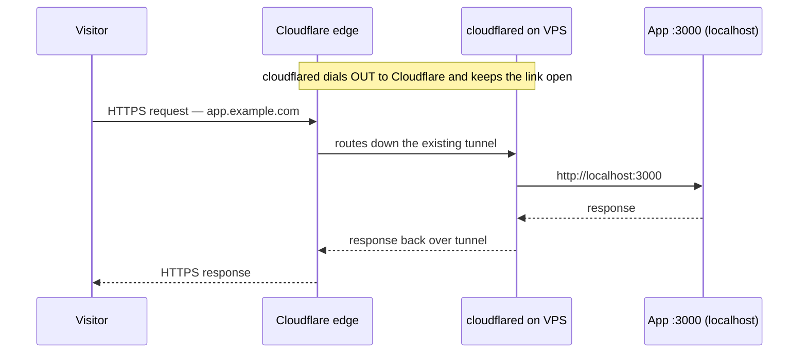
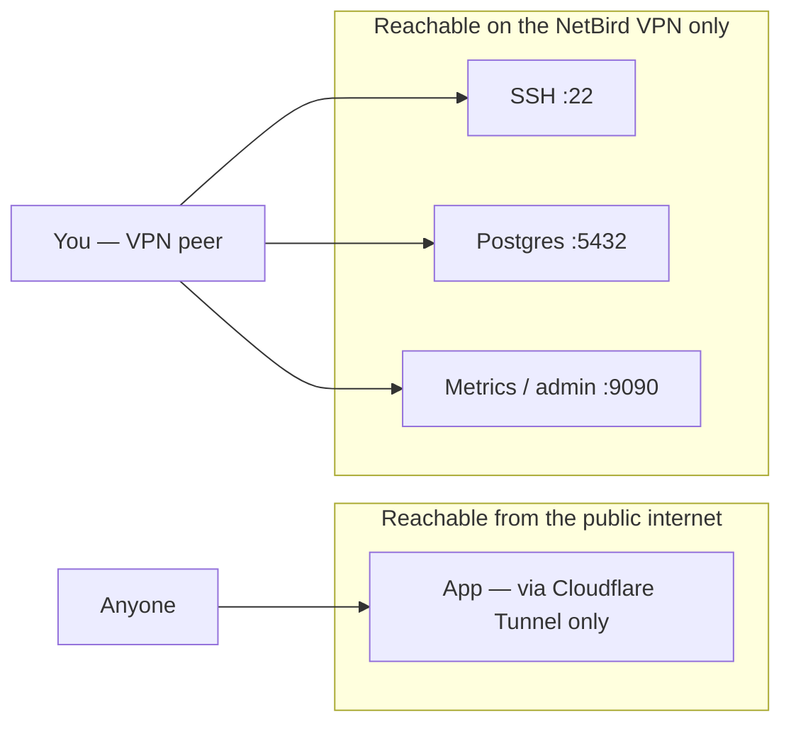

You buy a VPS, SSH in as `root` with the password the provider emailed you, and start deploying. Within minutes the box is being scanned. Not maybe — measurably. Watch `journalctl -u ssh` on a brand-new instance and you'll see login attempts against `root`, `admin`, and `postgres` before you've finished your coffee. The public IPv4 space is swept continuously, and an open port is an invitation.

This post is the setup I actually use. Three layers, each one closing a door the previous one left open:

1. **Harden the host** — a non-root user, key-only SSH, a default-deny firewall.
2. **Hide the box behind a VPN** — nothing admin-facing is reachable from the public internet at all. You reach SSH and the database only over an encrypted overlay (NetBird here; Tailscale is the same idea).
3. **Expose just the app** — a Cloudflare Tunnel publishes port 3000 to the world without opening a single inbound port on the server. Databases and internal services never leave the VPN.

The end state looks like this:



Notice what a port scan of the public IP sees after this: **nothing**. No SSH, no database, no app port. The only path in for a visitor is through Cloudflare; the only path in for you is through the VPN.

<svg viewBox="0 0 820 440" width="100%" style={{margin:'2.5rem auto',display:'block',maxWidth:'760px'}}>
  <rect x="12" y="12" width="796" height="416" rx="18" fill="rgba(255,255,255,0.015)" stroke="rgba(255,255,255,0.14)" strokeWidth="1.5"/>
  <text x="34" y="44" fill="rgba(255,255,255,0.5)" fontFamily="monospace" fontSize="16">Public internet</text>
  <rect x="58" y="62" width="704" height="344" rx="15" fill="rgba(39,208,171,0.03)" stroke="rgba(39,208,171,0.28)" strokeWidth="1.5"/>
  <text x="80" y="94" fill="#27d0ab" fontFamily="monospace" fontSize="16" opacity="0.8">Cloudflare edge · TLS + WAF</text>
  <rect x="104" y="112" width="612" height="244" rx="13" fill="rgba(39,208,171,0.05)" stroke="rgba(39,208,171,0.42)" strokeWidth="1.5"/>
  <text x="126" y="144" fill="#27d0ab" fontFamily="monospace" fontSize="16" opacity="0.9">NetBird VPN + host firewall</text>
  <rect x="150" y="162" width="520" height="144" rx="11" fill="rgba(39,208,171,0.08)" stroke="rgba(39,208,171,0.55)" strokeWidth="1.5"/>
  <text x="172" y="194" fill="#a9ffea" fontFamily="monospace" fontSize="16">Hardened Linux host</text>
  <rect x="322" y="222" width="176" height="56" rx="11" fill="rgba(39,208,171,0.16)" stroke="#27d0ab" strokeWidth="1.6"/>
  <text x="410" y="256" textAnchor="middle" fill="#ffffff" fontFamily="monospace" fontSize="17" fontWeight="600">App :3000</text>
</svg>

## The first ten minutes: harden the host

Do this the moment the instance boots, before you install anything else. Everything here happens as `root` over your provider's initial SSH access; by the end, root SSH is gone.

### Create a non-root user with sudo

Working as `root` day-to-day means every mistake and every compromised process runs with full privileges. Make a normal user and give it `sudo`:

```bash
# as root, on the VPS
adduser deploy
usermod -aG sudo deploy
```

Now copy your SSH **public** key to that user so you can log in without a password. From your laptop:

```bash
ssh-copy-id deploy@YOUR_SERVER_IP
```

If `ssh-copy-id` isn't available, do it by hand on the server:

```bash
mkdir -p /home/deploy/.ssh
# paste the contents of your laptop's ~/.ssh/id_ed25519.pub below
echo "ssh-ed25519 AAAA... you@laptop" >> /home/deploy/.ssh/authorized_keys
chown -R deploy:deploy /home/deploy/.ssh
chmod 700 /home/deploy/.ssh
chmod 600 /home/deploy/.ssh/authorized_keys
```

Open a **second** terminal and confirm `ssh deploy@YOUR_SERVER_IP` works *before* you touch SSH config. Locking yourself out of a fresh VPS is a rite of passage you can skip.

### Harden SSH: keys only, no root

Drop a config fragment rather than editing the main file — it survives package upgrades and is easy to reason about:

```bash
sudo tee /etc/ssh/sshd_config.d/99-hardening.conf > /dev/null <<'EOF'
PermitRootLogin no
PasswordAuthentication no
KbdInteractiveAuthentication no
PubkeyAuthentication yes
PermitEmptyPasswords no
MaxAuthTries 3
EOF

sudo systemctl restart ssh
```

That single change — `PasswordAuthentication no` — eliminates the entire category of brute-force and credential-stuffing attacks that make up the bulk of that scan traffic. There is no password to guess anymore. `PermitRootLogin no` means even a stolen key has to land on an unprivileged account first.

### Default-deny firewall

`ufw` (Uncomplicated Firewall) is the friendliest front-end to `iptables`. Set it to deny everything inbound, allow everything outbound, and — for now — allow SSH so you don't lock yourself out before the VPN is up:

```bash
sudo ufw default deny incoming
sudo ufw default allow outgoing
sudo ufw allow OpenSSH        # temporary — we remove this once the VPN is live
sudo ufw enable
```

`default deny incoming` is the whole game. Anything you don't explicitly allow is dropped. We'll delete even that SSH rule in the next section.

### Ban repeat offenders and patch automatically

Two low-effort installs that keep working while you sleep:

```bash
# fail2ban watches auth logs and temp-bans IPs that keep failing
sudo apt update && sudo apt install -y fail2ban

# unattended-upgrades applies security patches on its own
sudo apt install -y unattended-upgrades
sudo dpkg-reconfigure -plow unattended-upgrades
```

`fail2ban` matters far less once password auth is off and SSH is behind the VPN, but it's cheap insurance. `unattended-upgrades` closes the gap between a CVE landing and you noticing.

At this point you have a respectable, conventional setup. SSH is still exposed to the internet, though — just harder to break. The next layer removes it from the internet entirely.

## Layer two: put the whole box behind a VPN

Here's the shift in thinking. Instead of *hardening* the public-facing SSH port, we make it **not public at all**. The server joins a private overlay network — a mesh VPN — and SSH binds to that. Your laptop is on the same overlay. To the rest of the internet, port 22 simply doesn't answer.



I use [NetBird](https://netbird.io) because it's open source, WireGuard-based, and self-hostable if you ever want to. [Tailscale](https://tailscale.com) is nearly identical to operate — same mental model of a flat `100.x` overlay where every device gets a stable private IP.

### Install NetBird on the VPS

Create a **setup key** in the NetBird dashboard (Setup Keys → create one; a reusable key is convenient for adding more peers later). Then, on the server:

```bash
# installs the netbird agent and its repo
curl -fsSL https://pkgs.netbird.io/install.sh | sh

# join your network using the setup key
sudo netbird up --setup-key YOUR_SETUP_KEY
```

Install the NetBird client on your laptop too and sign in to the same account. Check the peering:

```bash
netbird status
```

You'll see a **NetBird IP** in the `100.64.0.0/10` range (say `100.92.0.14`) and an interface named `wt0`. That IP is stable — it's how you'll reach this box from now on. Confirm the mesh works by SSHing over it:

```bash
ssh deploy@100.92.0.14
```

### Close SSH to the public and pin it to the VPN

Now the satisfying part. Allow SSH only on the `wt0` interface, then delete the public rule:

```bash
# allow SSH only when it arrives on the NetBird interface
sudo ufw allow in on wt0 to any port 22 proto tcp

# remove the public SSH opening created earlier
sudo ufw delete allow OpenSSH

sudo ufw status verbose
```

For belt-and-suspenders, you can also bind the SSH daemon itself to the overlay IP so it never even listens on the public interface:

```bash
echo "ListenAddress 100.92.0.14" | sudo tee /etc/ssh/sshd_config.d/98-listen.conf
sudo systemctl restart ssh
```

> One caution: `ListenAddress` on the NetBird IP means SSH only comes up *after* `wt0` exists. If the NetBird agent fails to start, you'll need your provider's web/serial console to recover. Keep that console access bookmarked. Pinning by firewall (the `ufw` rule) alone is the safer default; add `ListenAddress` only once you trust the setup.

From here on, your firewall's inbound policy is essentially: *drop everything unless it came in over the VPN.*



But wait — if the firewall drops everything inbound and SSH is VPN-only, how does the app ever serve public traffic? It doesn't, directly. That's the job of the third layer, and the reason it's elegant: it needs **no inbound port at all**.

## Layer three: expose only the app with a Cloudflare Tunnel

A normal reverse-proxy setup means opening ports 80 and 443 to the world and hoping your TLS config and origin are airtight. A Cloudflare Tunnel inverts it. You run a small daemon — `cloudflared` — on the VPS that dials **outbound** to Cloudflare's edge and holds that connection open. Public requests arrive at Cloudflare, which pushes them down the existing tunnel to your app. Your firewall never sees an inbound connection, because there isn't one.



The app only ever binds to `localhost:3000`. It is never exposed to the VPS's public interface, so even if your firewall rules were wrong, there's nothing on the outside to hit.

The current, Cloudflare-recommended way to run a tunnel is **remotely managed** from the dashboard. You create and configure the tunnel in the browser; the VPS only ever runs one install command. There is no `config.yml` to write, no credentials file to babysit, and no `cloudflared tunnel login` — the tunnel's configuration lives in your Cloudflare account, not on the server.

### Create the tunnel in the dashboard

1. In the [Cloudflare dashboard](https://one.dash.cloudflare.com), go to **Networking → Tunnels** and select **Create a tunnel**.
2. Choose **Cloudflared** as the connector type, then give the tunnel a name — something that reflects the box, like `myapp-vps`.
3. Pick your server's operating system and architecture. The dashboard shows an **install command with an embedded tunnel token** — copy it.

> Two prerequisites: the domain you'll publish on must already be [added to Cloudflare](https://developers.cloudflare.com/fundamentals/manage-domains/add-site/) (nameservers pointing at Cloudflare), and the VPS must reach Cloudflare on **outbound TCP 7844**. Since our firewall allows all outbound traffic, that port is already open.

### On the VPS: run the one command

This is the *only* step that touches the server. The command the dashboard handed you installs `cloudflared`, registers it as a `systemd` service, and connects it to your tunnel using the token — all at once:

```bash
# the exact command is copied from the dashboard; it looks like this
curl -L --output cloudflared.deb \
  https://github.com/cloudflare/cloudflared/releases/latest/download/cloudflared-linux-amd64.deb
sudo dpkg -i cloudflared.deb

# install + connect as a service, using YOUR token from the dashboard
sudo cloudflared service install eyJhIjoiXXXXX...YOUR_TUNNEL_TOKEN
```

Back in the dashboard, wait for the connector's status to flip to **Connected**, then select **Continue**. Notice what you did *not* do: no inbound port opened, no `ufw` rule added, no certificate written to disk. `cloudflared` dialed out; the firewall's *deny all incoming* policy is untouched.

### Point the hostname at port 3000 — in the dashboard

Now publish the app. In the tunnel's settings, open the **Routes** tab (older dashboards call it *Public Hostname*), select **Add route → Published application**, and fill in:

- **Subdomain / Domain** — for example `app` + `example.com`, giving `app.example.com`.
- **Service** — type `HTTP`, address `localhost:3000`.

Save it. **This is where you expose the exact port** — Cloudflare now forwards requests for `app.example.com` down the tunnel to `http://localhost:3000`, and creates the DNS record for you automatically. Everything else on the box stays dark: only this one hostname resolves to this one port.

Visit `https://app.example.com` and you're hitting port 3000 through Cloudflare — with TLS, DDoS protection, and the WAF in front — while your VPS firewall still says *deny all incoming*. The only ports 80/443 in this story belong to Cloudflare, not to you.

## Databases and internal services: VPN-only, never public

The final principle: **anything that isn't the public app stays on the VPN.** Your database, an admin dashboard, a metrics endpoint, a Redis instance — none of them get a Cloudflare hostname and none of them get a public firewall rule. You reach them over NetBird, exactly like SSH.

Take Postgres. First, bind it to loopback and the NetBird IP only — never `0.0.0.0`:

```bash
# /etc/postgresql/16/main/postgresql.conf
listen_addresses = 'localhost,100.92.0.14'
```

```bash
# /etc/postgresql/16/main/pg_hba.conf — allow the NetBird range, require a password
host    all    all    100.64.0.0/10    scram-sha-256
```

Then allow the port on the VPN interface only, and restart:

```bash
sudo ufw allow in on wt0 to any port 5432 proto tcp
sudo systemctl restart postgresql
```

Now from your laptop — already a NetBird peer — you connect straight to the private IP:

```bash
psql "host=100.92.0.14 port=5432 dbname=app user=app"
```

No public database port. No SSH tunnel gymnastics. No bastion host. The VPN *is* the private network, and the database lives on it.



## The recap checklist

If you do nothing else, do these — roughly in order of impact:

- **Key-only SSH, no root, no passwords.** `PasswordAuthentication no` kills most attacks outright.
- **Default-deny firewall.** `ufw default deny incoming`. Everything else is an explicit exception.
- **Move admin access onto a VPN.** SSH, databases, and dashboards bind to the `wt0` overlay; the public firewall rule for SSH goes away.
- **Expose the app with a Cloudflare Tunnel**, not open ports. `cloudflared` dials out; nothing dials in. Publish the one hostname → one port, catch-all 404 for the rest.
- **Keep internal services internal.** Bind them to the NetBird IP, allow the port on `wt0` only, never publish them.
- **Keep console access to your provider bookmarked** in case the VPN agent ever fails to start.

The through-line is the same at every layer: reduce what's reachable. A hardened public port is good; an unreachable one is better. By the end, a stranger scanning your IP finds a wall with no doors — and the only doors that exist open onto a network they were never on.

---

Questions or a sharper way to wire any of this? I'm on [GitHub](https://github.com/lemasani).
